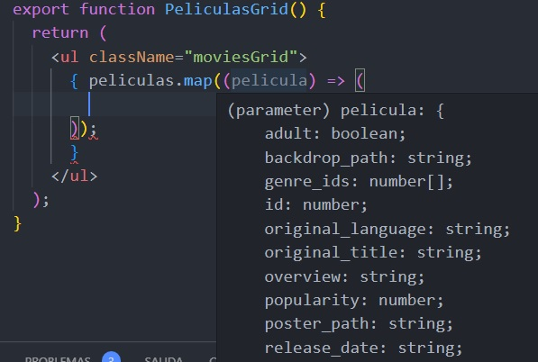
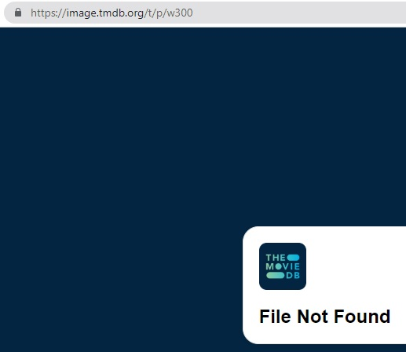

# Getting Started with Create React App

This project was bootstrapped with [Create React App](https://github.com/facebook/create-react-app).

## Available Scripts

In the project directory, you can run:

### `npm start`

Runs the app in the development mode.\
Open [http://localhost:3000](http://localhost:3000) to view it in your browser.

The page will reload when you make changes.\
You may also see any lint errors in the console.

### `npm test`

Launches the test runner in the interactive watch mode.\
See the section about [running tests](https://facebook.github.io/create-react-app/docs/running-tests) for more information.

### `npm run build`

Builds the app for production to the `build` folder.\
It correctly bundles React in production mode and optimizes the build for the best performance.

The build is minified and the filenames include the hashes.\
Your app is ready to be deployed!

See the section about [deployment](https://facebook.github.io/create-react-app/docs/deployment) for more information.

### `npm run eject`

**Note: this is a one-way operation. Once you `eject`, you can't go back!**

If you aren't satisfied with the build tool and configuration choices, you can `eject` at any time. This command will remove the single build dependency from your project.

Instead, it will copy all the configuration files and the transitive dependencies (webpack, Babel, ESLint, etc) right into your project so you have full control over them. All of the commands except `eject` will still work, but they will point to the copied scripts so you can tweak them. At this point you're on your own.

You don't have to ever use `eject`. The curated feature set is suitable for small and middle deployments, and you shouldn't feel obligated to use this feature. However we understand that this tool wouldn't be useful if you couldn't customize it when you are ready for it.

## Learn More

You can learn more in the [Create React App documentation](https://facebook.github.io/create-react-app/docs/getting-started).

To learn React, check out the [React documentation](https://reactjs.org/).

### Code Splitting

This section has moved here: [https://facebook.github.io/create-react-app/docs/code-splitting](https://facebook.github.io/create-react-app/docs/code-splitting)

### Analyzing the Bundle Size

This section has moved here: [https://facebook.github.io/create-react-app/docs/analyzing-the-bundle-size](https://facebook.github.io/create-react-app/docs/analyzing-the-bundle-size)

### Making a Progressive Web App

This section has moved here: [https://facebook.github.io/create-react-app/docs/making-a-progressive-web-app](https://facebook.github.io/create-react-app/docs/making-a-progressive-web-app)

### Advanced Configuration

This section has moved here: [https://facebook.github.io/create-react-app/docs/advanced-configuration](https://facebook.github.io/create-react-app/docs/advanced-configuration)

### Deployment

This section has moved here: [https://facebook.github.io/create-react-app/docs/deployment](https://facebook.github.io/create-react-app/docs/deployment)

### `npm run build` fails to minify

This section has moved here: [https://facebook.github.io/create-react-app/docs/troubleshooting#npm-run-build-fails-to-minify](https://facebook.github.io/create-react-app/docs/troubleshooting#npm-run-build-fails-to-minify)

# Creamos el proyecto peliculas-react

```
>npx create-react-app peliculas-react
```

```
>cd peliculas-react
```

```
npm start
```

# Archivo JSON

Añadimos el archivo `peliculas.json` a la carpeta `src`.  
Este archivo será la fuente de la información para la aplicación.

# Quitamos archivos que no vamos a usar

`setupTests.js`  
`reportWebVitals.js`, en el `index.js` quitamos la llamada y la importación.  
`logo.svg`, en el `App.js` quitamos la importación y la etiqueta img.  
`App.test.js`  
En el `index.js` quitamos la etiqueta `<React.StrictMode>`

# Cambiamos la extensión

Cambiamos la extensión del archvo `App.js` a jsx y limpiamos `<p></p>` y `<a></a>`

```jsx
import "./App.css";
import { PeliculasGrid } from "./PeliculasGrid";

function App() {
  return (
    <div>
      <header className="title">Pelicula</header>
      <main>
        <PeliculasGrid />
      </main>
    </div>
  );
}

export default App;
```

La etiqueta main va a contener un nuevo componente con una grilla de películas. Y ese componente tambien va a tener otro componente.

# PeliculasGrid.jsx

Cada película va hacer un `<li></li>`

```jsx
export function PeliculasGrid() {
  return (
    <ul>
      <li></li>
      <li></li>
      <li></li>
    </ul>
  );
}
```
Tengo que recorrer el json, lo hacemos con un map.  
Como es javascript es entre llaves.  
1ro. tengo que importar el json para tenerlo disponible.
Lo recorro y lo tengo que guardar con un nombre `(pelicula)`.  
Ahora **pelicula** es cada una de las películas del json y hacemos una función flecha.
  
Ahora todo eso que recorro lo voy a pasar a un componente para despues recibirlo en otro componente como props.
# Creo un componente PeliculasCard.jsx  
PeliculasCard.jsx va hacer el componente que se va a renderizar dentro del componente PeliculasGrid.jsx. PeliculasCard.jsx va hacer un `<li>` con el recorrido de todas las películas.  
Como lo voy a ecorrer tengo que mandarlo como parametro.
Al componente PeliculasCard le estoy pasando todas las películas recorridas con el map, para poder trabajar con estas películas.  
Cada vez que trabajo con un map y pase los parametros tengo que tener una key por sintaxis, 
una llave tiene que ser un parametro de los que esta recorriendo en este caso usamos id, que va hacer de `{pelicula.id}`.
Ahora creamos el componente PeliculasCard.jsx.
¿Que va a recibir el componente? `{pelicula}`, le envio todas las peliculas para recibirlo como props. Hago la importación.  
import peliculas from './peliculas.json';
import { PeliculasCard } from './PeliculasCard';

```jsx
export function PeliculasGrid() {
  return (
    <ul className="moviesGrid">
      { peliculas.map((pelicula) => (
				<PeliculasCard key={pelicula.id} pelicula={pelicula}/>
				))
			}
    </ul>
  );
}
```
```jsx
export function PeliculasCard({pelicula}) {
    return(
        
    )
}
```
En PeliculasCard.jsx solo quiero traerme el titulo de la película y la imágen de la película.  
En el json la imagen tiene la finalización de una URL, por lo cual tengo que tener la URL para completar la dirección y lo muestre. Por lo tanto tengo que concatenar con cada poster de la imagen. Entonces lo voy a guardar en una variable.

`const imgURL = "https://image.tmdb.org/t/p/w300" + pelicula.poster_path;`
Quiero retornar dentro de la etiqueta `li` la imagen y el titulo
```jsx
export function PeliculasCard({pelicula}) {
    // const imgURL = `https://image.tmdb.org/t/p/w300${pelicula.poster_path}`;
    const imgUrl = "https://image.tmdb.org/t/p/w300" + pelicula.poster_path;
    
    return(
        <li className="movieCard">
            
            <div>{pelicula.title}</div>
        </li>
    )
}
```
# Estilo App.css
```css
.title{
  text-align: center;
  font-size: 3rem;
  text-shadow: 0 0 10px #fff, 0 0 20px #fff, 0 0 30px #e60073, 0 0 50px #e60073, 0 0 60px #e60073, 0 0 70px #e60073;
}
```
# Estilo PeliculasGrid.css
```css
.moviesGrid{
    display: grid;
    grid-template-columns: repeat(auto-fill, 230px);
    gap: 40px;
    padding: 40px;
    justify-content: center;
}

@media (max-width: 560px) {
    .moviesGrid{
        grid-template-columns: 100%;
    }
}
```
# Estilo PeliculasCard.css
```css
.movieCard{
    list-style: none;
    font-size: 1.5rem;
    text-align: center;
}

.movieImage{
    border-radius: 10px;
    background-color: azure;
    width: 230px;
    height: 345px;
}

@media (max-width: 560px) {
    .movieImage{
        width: 90%;
        height: auto;
    }
}
```